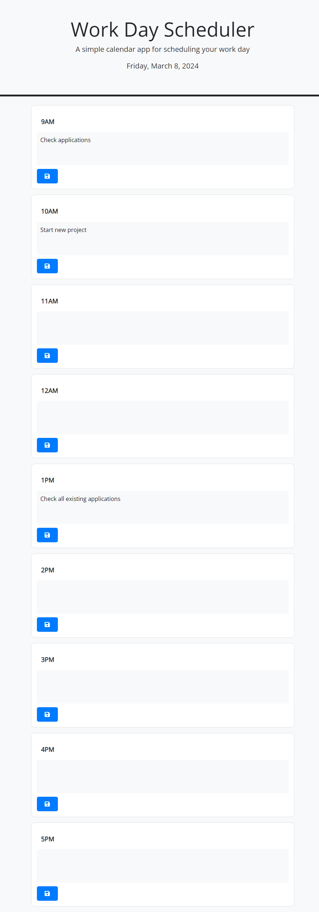

# Workday Scheduler

Workday Scheduler is a simple calendar application for scheduling your workday. It allows users to enter and save events for specific hours of the day and ensures that the saved events persist even after refreshing the page.

## Features

- Display the current date and time at the top of the calendar.
- Generate time blocks for standard business hours (9am-5pm).
- Color-code time blocks to indicate whether they are in the past, present, or future.
- Enter and save events for each hour of the day.
- Saved events persist in the browser's local storage.

## Technologies Used

- HTML
- CSS
- JavaScript
- jQuery
- Day.js

## How to Use

1. Open the `index.html` file in your web browser.
2. View the current date and time displayed at the top of the calendar.
3. Scroll down to view time blocks for each hour of the workday.
4. Each time block is color-coded to indicate whether it's in the past, present, or future.
5. Click into a time block to enter an event.
6. Click the save button to save the event for that time block.
7. Refresh the page to ensure that the saved events persist.

## Installation

1. Clone the repository: `git clone `
2. Navigate to the project directory: `cd workday-scheduler`
3. Open `index.html` in your preferred web browser.

## Contributing

I am always looking to improve my portfolio and welcome contributions and suggestions. Feel free to fork the repository, make changes, and submit a pull request. If you have any questions or suggestions, please don't hesitate to contact me.

## License
MIT License 

Copyright (c) [2024] [Michael Pierson]

Permission is hereby granted, free of charge, to any person obtaining a copy
of this software and associated documentation files (the "Software"), to deal
in the Software without restriction, including without limitation the rights
to use, copy, modify, merge, publish, distribute, sublicense, and/or sell
copies of the Software, and to permit persons to whom the Software is
furnished to do so, subject to the following conditions:

The above copyright notice and this permission notice shall be included in all
copies or substantial portions of the Software.

THE SOFTWARE IS PROVIDED "AS IS", WITHOUT WARRANTY OF ANY KIND, EXPRESS OR
IMPLIED, INCLUDING BUT NOT LIMITED TO THE WARRANTIES OF MERCHANTABILITY,
FITNESS FOR A PARTICULAR PURPOSE AND NONINFRINGEMENT. IN NO EVENT SHALL THE
AUTHORS OR COPYRIGHT HOLDERS BE LIABLE FOR ANY CLAIM, DAMAGES OR OTHER
LIABILITY, WHETHER IN AN ACTION OF CONTRACT, TORT OR OTHERWISE, ARISING FROM,
OUT OF OR IN CONNECTION WITH THE SOFTWARE OR THE USE OR OTHER DEALINGS IN THE
SOFTWARE.